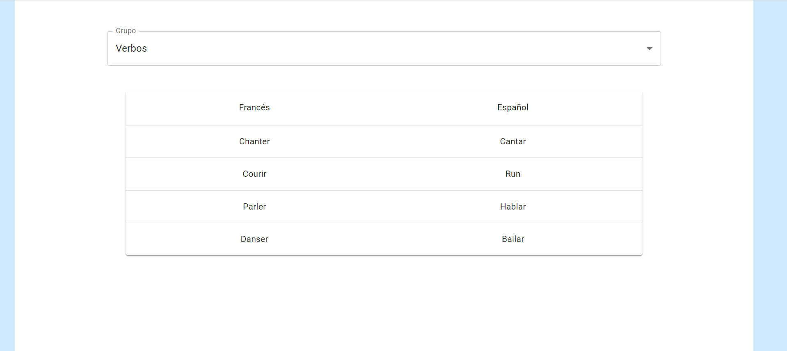

# Lang

Este proyecto busca crear un servidor web para estudiar vocabulario y volcar mis conocimentos en Kubernetes en él.

## Ejecutar el namespace (necesario)

`kubectl -f namespace.yaml`

# 1. mongoDB

Servicio de Mongo para guardar los datos. Se encuentra en el directorio **mongoDB**. Está formado por:

- kubernetes: Carpeta donde se guardan los .yaml de kubernetes.
- readme: Contiene información de como ejecutar este servicio.

# 2. mongoConnector

Servicio de un servidor API rest usando Flask para el acceso a la base de datos. Se encuentra en el directorio **mongoConnector**. Está formado por:

- code: Se encuentra el código principal del servicio.
- kubernetes: Carpeta donde se guardan los .yaml de kubernetes.
- readme: Contiene información de como ejecutar este servicio.
- Dockerfile: Fichero de Docker para crear la imagen.
- requirements.txt: Dependencias de python del servicio.

# 3. frontend

Cliente web para acceder a la información del servidor. Se encuentra en el directorio **frontend** y esta basado en arquitectura react. Está organizado de la siguiente manera:

- src: Se encuentra el código principal del servicio.
- Dockerfile: Fichero de Docker para crear la imagen.
- .dockerignore: Fichero de Docker para ignorar ciertos archivos no necesarios para la imagen
- package.json / package-lock.json: Dependencias de JS del servicio.
- readme: Contiene información de como ejecutar este servicio.

Una captura del frontend:

# 4. Auth0

Utilizado para gestionar la creación de perfiles ....

# Hoja de Ruta

- Añadir POST/DELETE/PUT al front-end [pendiente]
- Terminar de documentar la API [pendiente]
- Añadir Readiness y Liveness a los contenedores [pendiente]
- Acceder a la api desde la petición de navegador de manera correcta [pendiente]
- Crear todo en entornos de Produccion [medio-listo]
- Añadir proceso de autentificación-perfiles [listo]
- Ajustar visibilidad de cada uno de los contenedores [futuro]

# Objetivos completados

- Crear el modelo básico de datos en el servidor de FLASK [listo]
- Crear el servidor API en desarrollo con uwsgi [listo]
- Crear un servicio de front-end usando REACT JS [listo]
- Actualizar el Volumen de Persistencia para que guarde bien los datos [listo]

# Actualizaciones

- 20/05/2022: Perfiles usando Auth0
- 18/05/2022: Versiones de prod de Flask y React
- 17/05/2022: Almacenamiento permanente en mi PC
- 17/05/2022: Primera versión operativa de React
- 16/05/2022: React funciona en kubernetes y se comunica con Flask
- 16/05/2022: Creado el back end con Mongo y Flask
